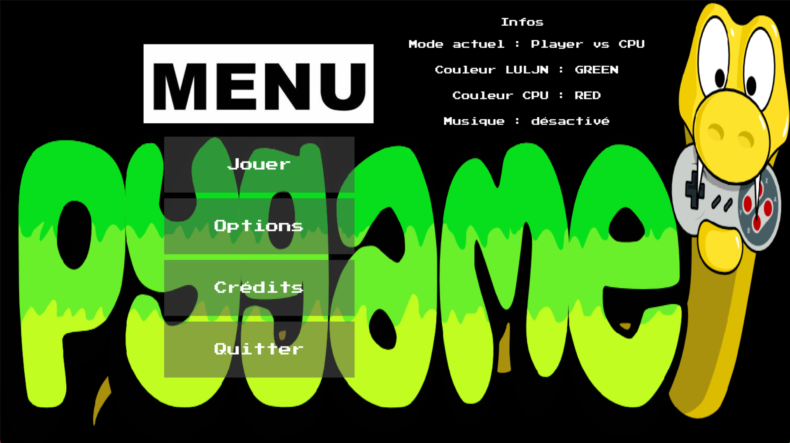
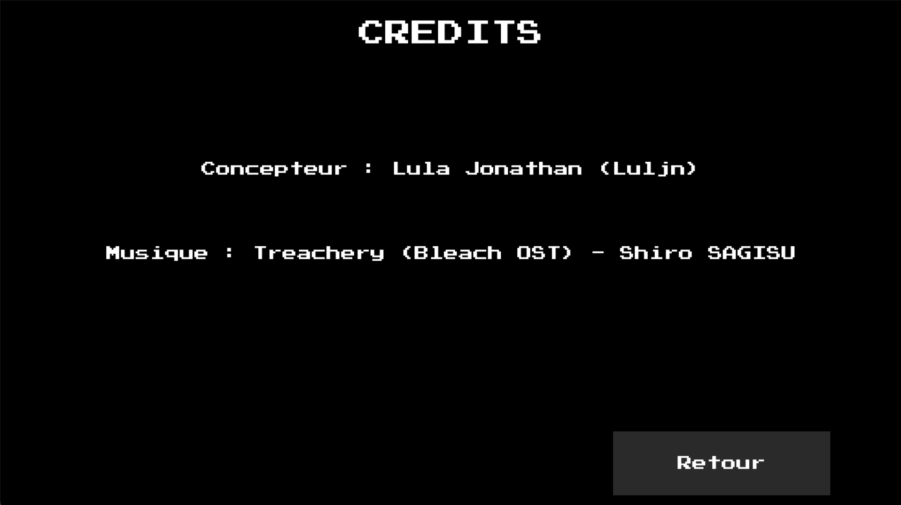
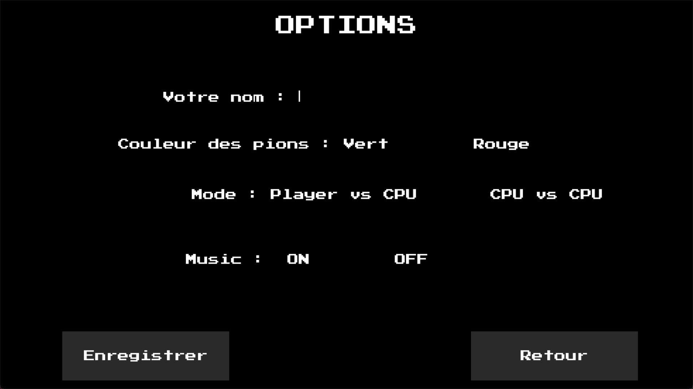

# Description

A two-player game powered by Artificial Initelligence (for Windows OS).

# Tools used.

- Python. 
- Pygame. 

# Run the code.

1) Install Python if you haven't already.
2) Install pygame and pygame-textinput modules, if you haven't already.
3) Execute the main file (force_3.py).

# The application

Home view

Credits View

Configurations View

## Author

Luljn.